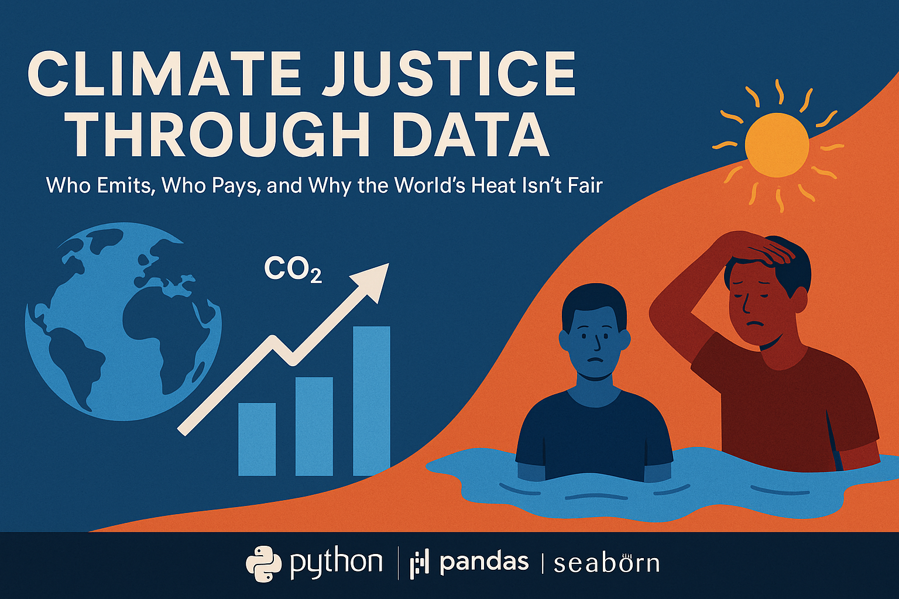

  

<h1 align="center">🌍 Climate Justice Through Data</h1>

<i>Who Emits, Who Pays, and Why the World’s Heat Isn’t Fair</i>

# climate-justice-carbon-analysis
Data-driven analysis of global CO₂ emissions, climate risk, and inequality using Python
